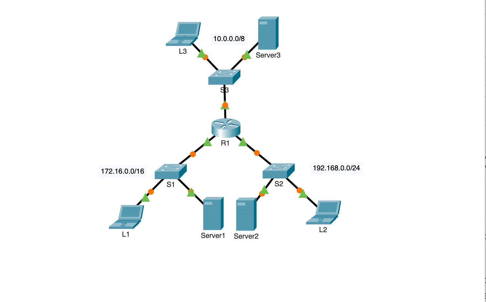
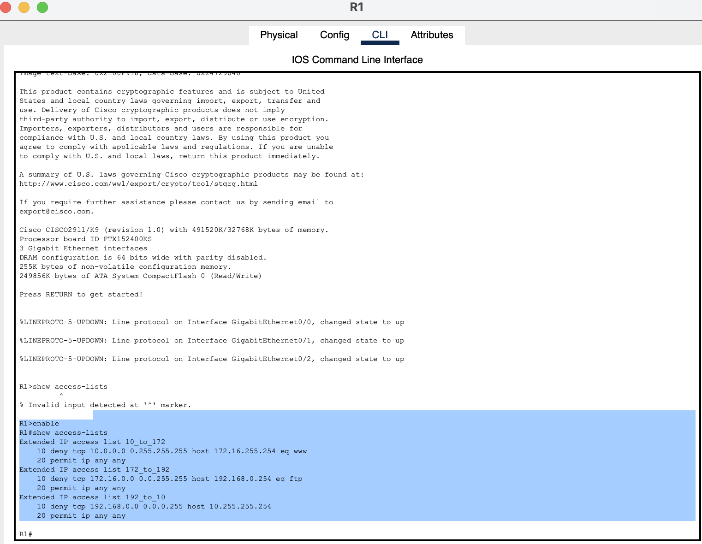
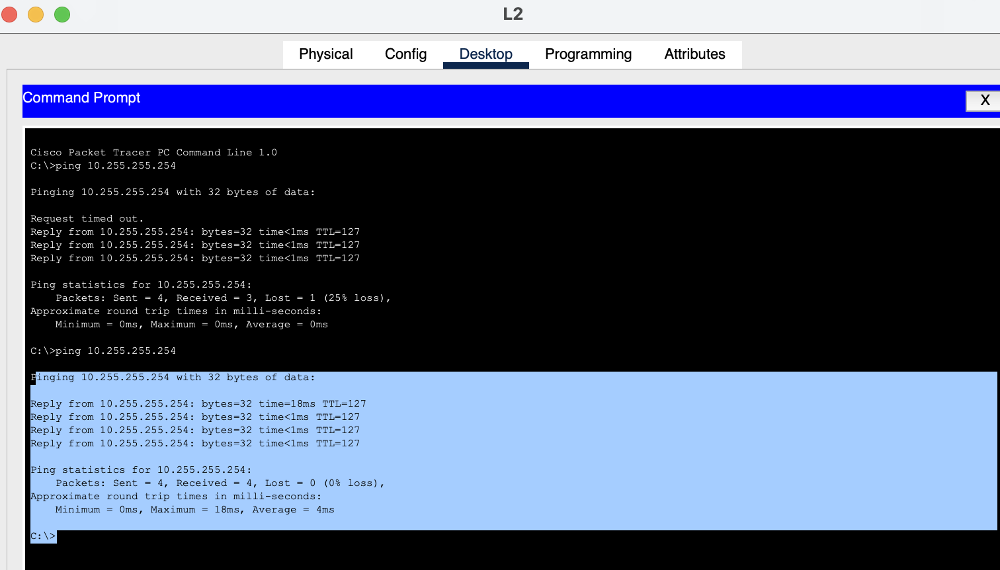

# Cisco Packet Tracer – IPv4 ACL Troubleshooting

## Project Overview

This project demonstrates troubleshooting and correcting Extended IPv4 Access Control Lists (ACLs) in Cisco Packet Tracer.

## Project Scenario

The network contained incorrect Extended IPv4 Access Control List (ACL) configurations. My task was to troubleshoot the router configuration, identify incorrect ACL rules and interface directions, apply the correct ACLs, and verify that only the required traffic was blocked while all other legitimate traffic was allowed.

---

## Skills Demonstrated

- Cisco Packet Tracer
- Extended IPv4 ACL Configuration
- ACL Troubleshooting
- Cisco IOS CLI
- Router Configuration
- Network Verification
- Connectivity Testing
- ICMP, HTTP, and FTP Traffic Testing

---

## Tasks Completed

- Identified ACL configuration errors.
- Corrected Extended IPv4 ACL rules.
- Applied ACLs to the appropriate router interfaces.
- Verified inbound and outbound ACL directions.
- Tested network connectivity using Ping, HTTP, and FTP.
- Saved and verified the final router configuration.

---

## Verification

The verification process included:

- Network topology validation.
- ACL verification using Cisco IOS commands.
- Router interface verification.
- Successful connectivity testing after troubleshooting.

---

## Tools

- Cisco Packet Tracer
- Cisco IOS CLI

---
## Screenshots

### Network Topology

### ACL Verification

### Connectivity Testing

---

## Learning Outcomes
Through this project, I strengthened my ability to:

- Configure and troubleshoot Extended IPv4 ACLs.
- Apply ACLs to the correct router interfaces.
- Verify ACL functionality using Cisco IOS commands.
- Test permitted and denied traffic.
- Troubleshoot ACL direction and rule configuration issues.
- Validate network connectivity after applying security policies.
