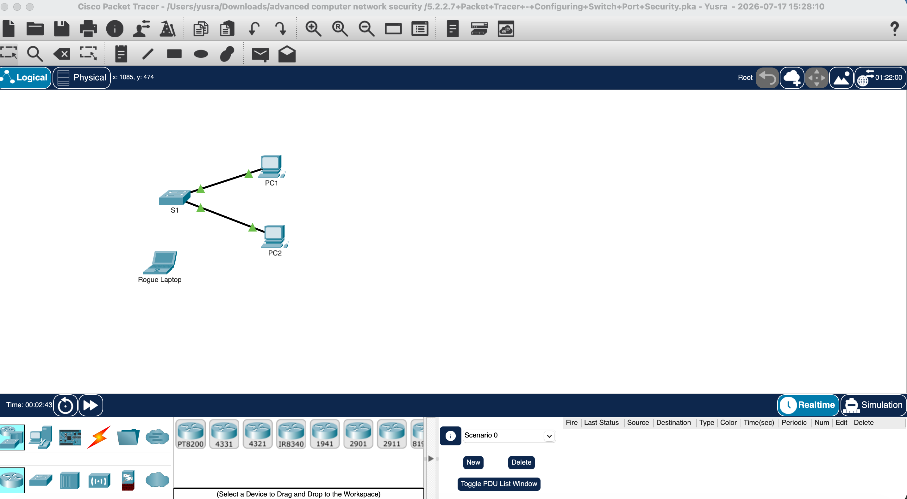
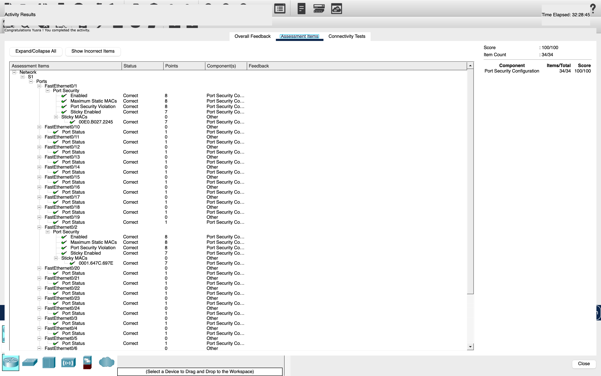

# Lab 01 - Configuring Switch Port Security

## Objective

Configure Cisco switch port security to allow only authorized devices.

## Lab Tasks

- Configure Port Security
- Configure Sticky MAC Address
- Configure Violation Mode
- Verify Port Security

## Skills Practiced

- Cisco IOS CLI
- Switch Configuration
- Port Security
- Sticky MAC Address
- Show Commands

## Result

Successfully completed the Cisco Packet Tracer activity with a score of 100%.
## Topology

## Results

